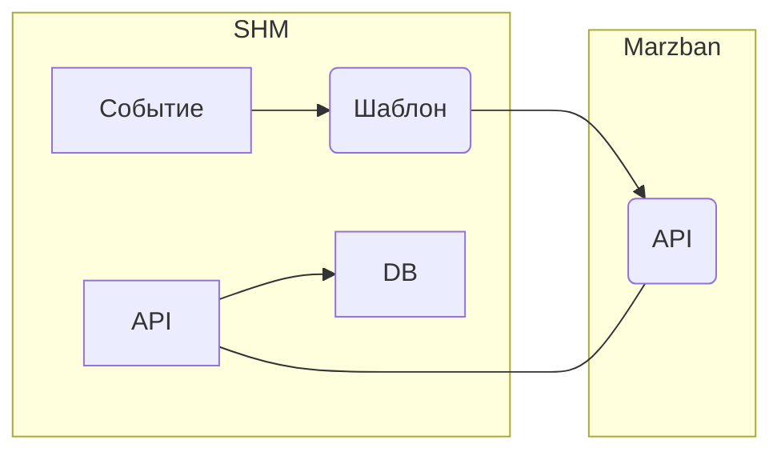

---
title: Marzban
weight: 20
---

В данном разделе описывается процесс интеграции SHM и Marzban.

Marzban - проект с открытым исходным кодом (https://github.com/Gozargah/Marzban)

Это инструмент управления прокси, который предоставляет простой и удобный пользовательский интерфейс для управления сотнями учетных записей прокси,
работающий на базе Xray-core.

Marzban удобен в использовании, многофункциональен и надежен.
Он позволяет вам создавать разные прокси для ваших пользователей без какой-либо сложной настройки.
Используя встроенный веб-интерфейс, вы можете отслеживать, изменять и ограничивать пользователей.

>> Шаблон Marzban работает в SHM начиная с версии 0.5.6. Обновите SHM, если ваша версия меньше.

## Принцип взаимодействия SHM и Marzban

## Интеграция

- Создайте в SHM шаблон с именем `marzban` (можно любое другое имя) и поместите туда содержимое из этой
[ссылки](https://raw.githubusercontent.com/danuk/shm-templates/main/marzban/shm_actions_script.sh).
- В конфигурации SHM создайте параметр с именем `acme`, после чего добавьте туда ключ `email_for_certificate_issue` и укажите Ваш реальный email. Он нужен для выпуска SSL сертификата для вашего домена.
- Создайте отдельную группу серверов, например: `VPN Marzban group`
- Создайте новый сервер и включте его в группу `VPN Marzban group`. В качестве транспорта укажите SSH и укажите наш шаблон `marzban`.
- Добавьте ключ SSH на ваш сервер, проверьте, что сервер работает (кнопка TEST).
- В `settings` сервера пропишите переменную: `subscription_domain`. Укажите ваш домен, который указывает на Ваш сервер. Этот домен крайне важен для выпуска SSL сертификата.
- Создайте все нужные [Cобытия]() в SHM, и укажите там нашу группу серверов (`VPN Marzban group`). Укажите категорию услуг: `vpn-mz-test`
- Создайте и настройте [Услуги](). Укажите категорию услуг: `vpn-mz-test`.

## Инсталляция сервера Marzban

>> На сервере куда вы планируете инсталлировать Marzban должен быть свободным https порт (443).

- Вы можете инсталлировать сервер Marzban с помощью SHM, выбрав этот шаблон (marzban) и нажав кнопку INIT.
Предварительно укажите адрес сервера (`host_name`) в settings сервера.
- Вы можете вручную инсталлировать сервер Marzban, следуя официальным инструкциям со страницы проекта Marzban.

## Управление ключами

SHM управляет ключами Marzban используя API. Для авторизации убедитесь, чтобы на сервере c Marzban в файле `/opt/marzban/.env` были прописаны `SUDO_USERNAME` и `SUDO_PASSWORD`.
Если инсталляция Marzban производилась с помощью SHM, то все нужные переменные уже прописаны.

## Marzban Dashboard (Web UI)

Для доступа к Web панели Marzban используйте ссылку вида: `http://IP:8000/dashboard`

Логин и пароль вы можете узнать зайдя на сервер с Marzban (по SSH), и выполнить следующие команды:
* Логин: `grep '^SUDO_USERNAME=' /opt/marzban/.env | tr -d 'SUDO_USERNAME='`
* Пароль: `grep '^SUDO_PASSWORD=' /opt/marzban/.env | tr -d 'SUDO_PASSWORD='`

## Доступ к данным (ключам) пользователей

После создания подписки "ключей" данные сохраняются в Хранилище SHM.

Получить данные можно разными способами.

### Получить данные через API SHM:
- URL для пользователя: `/shm/v1/storage/manage/vpn_mrzb_$USI`
- URL для Админа: `/shm/v1/storage/manage/vpn_mrzb_$USI?user_id=$USER_ID`

Где `$USI` - идентификатор услуги пользователя, `$USER_ID` - идентификатор пользователя

### Получение данных в Шаблонах SHM:
- Пример получения ключа (начинающегося на `ss:`):   `{{ storage.read('name','vpn_mrzb_' _ us.id ).links.grep('^ss:').first  }}`
- Пример получения ссылки для подписки:   `{{ storage.read('name','vpn_mrzb_' _ us.id ).subscription_url }}`

>> В Telegram bot используйте `args.0` вместо `us.id`.

## Telegram bot

[Настройте]() Telegram bot, если хотите продавать услуги через Telegram.

Вы можете использовать готовый шаблон для Telegram. Для этого, создайте шаблон `telegram` и поместите туда [код](https://raw.githubusercontent.com/danuk/shm-templates/main/telegram_bot/vpn/telegram-vpn-by-category.tmpl).

