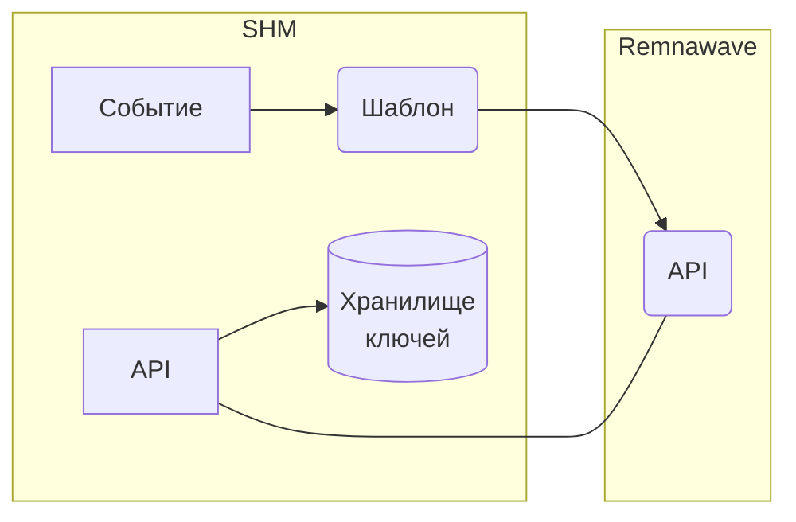

---
title: Remnawave
weight: 0
---

В данном разделе описывается процесс интеграции SHM и Remnawave.

[Remnawave](https://docs.rw/) - Решение для управления прокси-серверами и пользователями

Remnawave, созданное на основе Xray Core, предоставляет широкие возможности для управления пользователями и прокси-серверами.
Легко добавляйте пользователей, узлы, настраивайте Xray и многое другое с помощью многофункционального REST API на базе
NestJS.

## Принцип взаимодействия SHM и Remnawave



## Инсталляция сервера Remnawave

>> Remnawave предлогает широкий выбор установки с разными обратными прокси, поэтому нет явного шаблона/скрипта установки Remnawave

## Интеграция

>> Шаблоны для Remnawave есть в открытом доступе так же для продажи, так как шаблоны отличаются исходя от версии Remnawave тут шаблона нет.

- Создайте в SHM шаблон с именем `remnawave` и заполните его.
- Создайте отдельную группу серверов, например: `Remnawave group`
- Создайте новый сервер и включте его в группу `Remnawave group`. В качестве транспорта укажите SSH и укажите наш шаблон `remnawave`.
- Добавьте ключ SSH на ваш сервер, проверьте, что сервер работает (кнопка TEST).
- В `settings` сервера пропишите нужные переменные, например: `host` и `token` для работы с API Remnawave
- Создав несколько серверов в группе `Remnawave group` можно в `settings` сервера прописать UUID Сквада/ов, чтобы отдавать разные конфигурации пользователям.
- Создайте все нужные [Cобытия]() в SHM, и укажите там нашу группу серверов (`Remnawave group`). Укажите категорию услуг: `vpn-remnawave`
- Создайте и настройте [Услуги](). Укажите категорию услуг: `vpn-remnawave`.
- Создайте API токен в Remnawave и пропишите его например в `settings` сервера/ов

## Доступ к данным пользователей

После создания подписки "ключей" данные сохраняются в Хранилище SHM.

Получить данные можно разными способами.

>> `vpn_remnawave_` прописан как пример, вы можете указать свой префикс.

### Получить данные через API SHM:
- URL для пользователя: `/shm/v1/storage/manage/vpn_remnawave_$USI`
- URL для Админа: `/shm/v1/storage/manage/vpn_remnawave_$USI?user_id=$USER_ID`

Где `$USI` - идентификатор услуги пользователя, `$USER_ID` - идентификатор пользователя

### Получение данных в Шаблонах SHM:
- Пример получения ключа для приложения Happ: <br> `{{ storage.read('name','vpn_remnawave_' _ us.id ).happ.cryptoLink  }}`
- Пример получения ссылки для подписку: <br> `{{ storage.read('name','vpn_remnawave_' _ us.id ).response.subscriptionUrl }}`

>> В Telegram bot используйте `args.0` вместо `us.id`.

## Telegram bot

[Настройте]() Telegram bot, если хотите продавать услуги через Telegram.


 - Пример вывода ссылку на подписку в виде QR-кода внутри Telegram bot
```
<% CASE '/show_sub_qr' %>
{{ subscriptionUrl = storage.read('name','vpn_remnawave_' _ args.0 ).response.subscriptionUrl }}
{{ tg_api( printQrCode = {
        data = subscriptionUrl
        parameters = {
            caption = "Отсканируйте QR-код"
        }
    }
) }}
```
