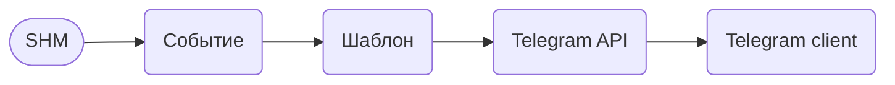
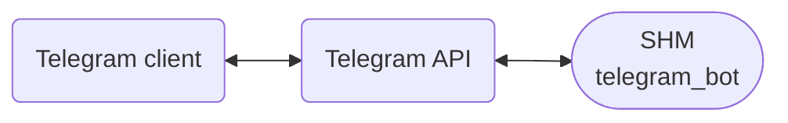

---
title: "Telegram"
weight: 40
---

Telegram - популярный мессенджер (https://telegram.org/)

В этом разделе описывается способ настройки транспорта Telegram.

Транспорт Telegram умеет как просто отправлять уведомления, так и работать в качестве полноценного бота: регистрировать клиентов, услуги, пополнять баланс и т.п.

## Telegram уведомления

Для того, чтобы SHM мог отправлять сообщения Вашим пользователям, необходимо:
1. Создать Telegram Bot-а, с помощью бота @BotFather (https://telegram.me/BotFather)
2. В админке, в "Настройки" -> "Конфигурация", необходимо сохранить Telegram Token, полученный на предыдущем шаге
3. Создайте шаблон сообщения в админке, которое вы хотите отправлять своим пользователям ("Настройки" -> "Шаблоны")
4. Создайте нужное событие. Привяжите Ваш шаблон к нужному событию. В качестве группы серверов необходимо указать "Telegram уведомления", или любую другую группу, транспорт которой "telegram"
5. Дайте Вашему пользователю ссылку на вашего бота, чтобы он мог его себе добавить. После добавления бота Ваш клиент сможет получать от него уведомления

> В случаях, когда Ваш клиент регистрировался в SHM НЕ через Telegram bot-а, необходимо указать его логин telegram в его профиле (кабинете)

## Telegram bot

Для работы полноценного бота нужно:
- Выполнить шаги 1 и 2 из предыдущего раздела (Telegram уведомления), если еще не выполнены.
- Настроить Telegram API, сообщить ему адрес, куда отправлять запросы от клиента (от бота). Для этого [скачайте](https://raw.githubusercontent.com/danuk/shm/master/scripts/telegram/setWebhook.sh) bash скрипт.
Перед запуском скрипта необходимо его отредактировать, записать в него свой token и HTTP адрес SHM. Выполните скрипт.
- Проверьте наличие шаблона `telegram_bot`. Внесите в него изменения по своему усмотрению.
- Запустите бота (`/start`). Если всё настроено верно, вы увидите приветствие.

> Telegram bot - использует шаблон `telegram_bot`. В шаблоне заложена вся логика бота.

Более подробно о шаблоне Telegram читайте здесь: [Шаблон Telegram bot]()

