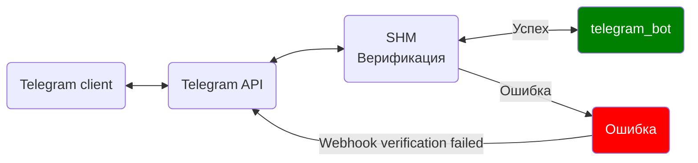

---
title: "Telegram"
weight: 40
---

Telegram - популярный мессенджер (https://telegram.org/)

В этом разделе описывается настройка транспорта Telegram и способы его использования.

Транспорт Telegram позволяет:
- Отправлять уведомления/сообщения клиентам с помощью Telegram
- Работать в качестве полноценного Бота (оказывать услуги, принимать платежи и т.п.)

Для написания ботов используются API методы Telegram. Ознакомится с полным списком методов вы можете в [официальной документации
Telegram](https://core.telegram.org/bots/api). Ниже приведены примеры для метода [`sendMessage`](https://core.telegram.org/bots/api#sendmessage).

## Профили Telegram в SHM

Для работы SHM с Telegram ему необходимо знать `token` бота. SHM поддерживает работу сразу с несколькими ботами.
Для удобного управлениями конфигурациями ботов введено понятие "Профиль". Обычно, профиль бота совпадает с именем шаблона.

Для шаблона бота с названием `telegram_bot` создайте одноименный профиль (`telegram_bot`), и пропишите в этот профиль `token` бота,
который будет работать с этим шаблоном. Если у вас есть и другие боты, настройте их по аналогии.

Если профиль используется для отправки Telegram уведомлений в конкретный чат, то дополнительно укажите в профиле и `chat_id`.

Профили ботов настраиваются в Админке SHM. В разделе "Конфигурация" выберите пункт `telegram` и кликните по нему дважды.
В открывшемся окне кликните на "шестеренку" для открытия редактора JSON.

Создайте/настройте конфигурацию ваших ботов, пример:


## Telegram уведомления


### Настройка
Для того, чтобы SHM мог отправлять сообщения Вашим пользователям, необходимо:
1. Создать Telegram Bot-а, с помощью бота [@BotFather](https://t.me/BotFather) (https://handbook.tmat.me/ru/dev/botfather)
2. Создайте "Профиль" в SHM и укажите в нем `token` созданного бота
3. Создайте шаблон сообщения в админке, которое вы хотите отправлять своим пользователям ("Настройки" -> "Шаблоны")
4. Создайте нужное событие. Привяжите Ваш шаблон к нужному событию. В качестве группы серверов необходимо указать "Telegram уведомления", или любую другую группу, транспорт которой "telegram"
5. Дайте Вашему пользователю ссылку на вашего бота, чтобы он мог его себе добавить. После добавления бота Ваш клиент сможет получать от него уведомления

> В случаях, когда Ваш клиент регистрировался в SHM НЕ через Telegram bot-а, необходимо указать его логин telegram в его профиле (кабинете)

### Отправка уведомлений

Отправить сообщения в Telegram своим клиентам можно следующими способами:
1. С помощью транспорта Telegram
2. С помощью специального метода Шаблонизатора (`telegram.send()`)
3. С помощью специального метода Шаблонизатора (`telegram.bot()`)

#### `Отправка текста с помощью транспорта Telegram`
- Создайте шаблон с нужным текстом для отправки клиентам
- Привяжите шаблон к нужному событию, указав при этом транспорт Telegram

Пример шаблона отправки текста в Telegram:
```go
Тестовое сообщение для пользователя: {{ user.full_name }}
```

#### `Использование API Telegram с помощью транспорта Telegram`
Если вы хотите отправить не просто текст:
- Создайте шаблон с `JSON` данными для отправки в API Telegram
- Привяжите шаблон к нужному событию, указав при этом транспорт Telegram
- Пропишите в `settings` шаблона: `{"telegram":{"raw":true}}`

Пример использования [`sendMessage`](https://core.telegram.org/bots/api#sendmessage) в API Telegram:
```go
{{ toJson( sendMessage = {
  text = "Тестовое сообщение для пользователя: " _ user.full_name
  reply_markup = {
    inline_keyboard = [[{
      text = "Посетите наш сайт"
      url = "https://domain.com"
    }]]
  }
  })
}}
```

Пример шаблона отправки нескольких сообщений в API Telegram:
```go
{{ data = [] }}
{{ data.push( sendMessage = { text = 'Сообщение 1' } ) }}
{{ data.push( sendMessage = { text = 'Сообщение 2' } ) }}
{{ toJson( data ) }}
```

>> Если клиент использует сразу несколько ботов, то получит сообщение в каждый из них. Если нужно указать конкретный Профиль, то это можно сделать путем указания его в `settings` шаблона: `{"telegram":{"profile":ИМЯ_ПРОФИЛЯ}}`

### Отправка уведомлений себе

В случае, если Вы хотите отправлять системные сообщения себе в Telegram, то для этого:
- Создайте шаблон с нужным содержимым
- Создайте отдельный Профиль Telegram, укажите в нём `token` бота и `chat_id`, куда отправлять сообщения
- В `settings` шаблона укажите Профиль: `{"telegram":{"profile":"ИМЯ_ПРОФИЛЯ"}}`
- Привяжите ваш шаблон к нужным событиям


## Telegram bot

- Telegram bot реализован с помощью шаблона SHM (`telegram_bot` по-умолчанию)
- Telegram client отправляет [x-telegram-bot-api-secret-token](https://core.telegram.org/bots/api#setwebhook) в заголовке запроса. SHM сравнивает его с вашим `secret` который прописан рядом с `token`


Для работы полноценного бота нужно:
- Выполнить шаги 1 и 2 из раздела: "Telegram уведомления" (если еще не выполнены).
- Настроить Telegram API, сообщить ему адрес, куда отправлять запросы от клиента (от бота). Для этого скачайте bash скрипт [setWebhook.sh](https://raw.githubusercontent.com/danuk/shm/master/scripts/telegram/setWebhook.sh). Перед запуском скрипта необходимо его отредактировать, укажите:
  - `token` бота
  - `secret` 1–256 символов. Разрешены только символы A–Z, a–z, 0–9, _ и -. Вы можете сгенерировать `secret` с помощью следующей команды: `openssl rand -hex 32`
  - адрес SHM (например: domain.com)
  - имя шаблона (`telegram_bot` по-умолчанию)
- Выполните скрипт `setWebhook.sh` на любом Linux/Unix устройстве, так же подойдет и MacOS.
- Проверьте наличие шаблона для бота (`telegram_bot` по-умолчанию). Внесите в него изменения по своему усмотрению.
- Пропишите `secret` в [конфигурацию](https://docs.myshm.ru/docs/setup/servers/transport/telegram/#%D0%BF%D1%80%D0%BE%D1%84%D0%B8%D0%BB%D0%B8-telegram-%D0%B2-shm) SHM, обратите внимание на название шаблона, по умолчанию `telegram_bot`
- Зайдите в своего бота в клиенте Telegram и выполните команду: `/start`. Если всё настроено верно, вы увидите приветствие.

>> По-умолчанию SHM определяет профиль для бота по имени шаблона. Если нужно использовать другой профиль, то это можно указать в скрипте `setWebhook.sh`, добавив после имени шаблона параметр: `tg_profile`, например: `telegram_bot?tg_profile=profile1`

Более подробно о шаблонах Telegram читайте здесь: [Шаблон Telegram bot]()

