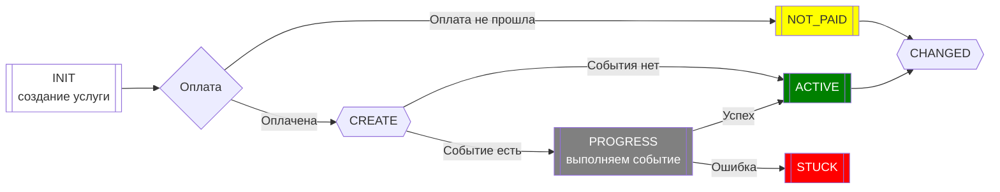
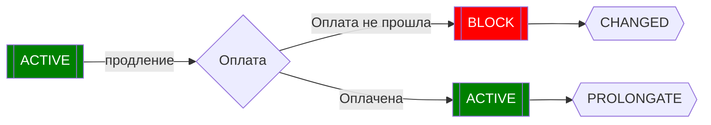
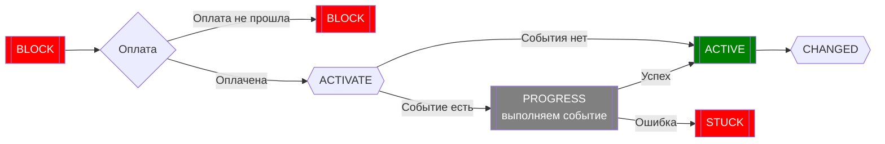

События генерируются SHM, для возможности привязки команд.

Событие происходит между переходом услуги пользователя из одного статуса в другой.

## Список cобытий

| Event             | Статус ДО | Статус ПОСЛЕ |  Описание                                                         |
|:------------------|:---------:|:------------:|-------------------------------------------------------------------|
| create            | INIT      | ACTIVE       | Услуга создана и оплачена (впервые)                               |
| not_enough_money  | INIT      | NOT_PAID     | Не хватает денег для создания услуги                              |
| prolongate        | ACTIVE    | ACTIVE       | Услуга продлена (хватило денег для продления активной услуги)     |
| block             | ACTIVE    | BLOCK        | Услуга заблокирована (нехватка денег для продления, либо вручную) |
| activate          | BLOCK     | ACTIVE       | Услуга активирована (возобновлена после блокировки)               |
| remove            | BLOCK     | REMOVED      | Услуга удалена                                                    |
| changed           | *         | *            | Событие вызывается каждый раз, когда меняется статус услуги       |

Если для события настроена команда, то пользовательской услуге будет присвоен промежуточный статус: `PROGRESS`,
а после выполнения команды пользовательской услуге будет присвоен результирующий статус.

### Схема создания новой услуги:

### Схема продления услуги:

> событие PROLONGATE не переводит услугу в статус PROGRESS, и событие CHANGED не вызывается

### Схема разблокировки услуги:

## Настройка событий

Для события необходимо указать "Категорию" услуги и "Группу серверов", для выполнения команд.

Категория события должна соответствовать категории услуги, для которой создается это событие и может быть указана с маской,
например: `vpn-*`, где `*` заменяет любые символы.

В зависимости от выбранной группы серверов, могут быть использованы дополнительные настройки, зависящие от [Транспорта]() группы.

Например, если выбрана группа серверов, транспорт которой определен как ["SSH"](), то будет предложено выбрать шаблон в качестве скрипта, который должен быть выполнен на конечном сервере.
Используйте [Шаблоны]() для написания команд.

А если выбрана группа серверов, транспорт которой определен как ["Mail"](), то можно настроить поле ["Шаблон"]() (`template_id`), по которому будет
сформировано письмо, а так-же другие поля, такие как "Тема письма" (`subject`) и прочие.

Настройки серверов можно переопределять настройками событий.

